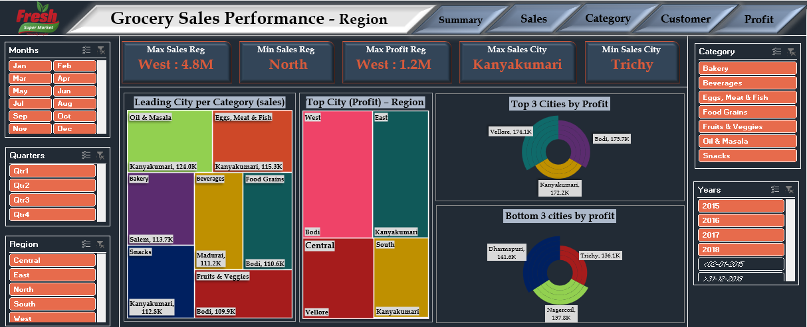
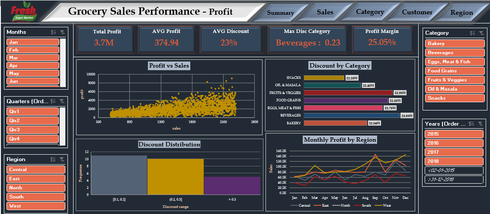

<h1 align="center">🛒 Supermart Grocery Sales Analysis</h1>

  <b>Business Analytics Project using Excel, Power Query & Dashboards</b>

<h2>📌 Project Overview</h2>

This project analyzes grocery sales data from a supermarket / grocery delivery system.
The goal is to understand <b>sales performance, customer behavior, category trends, regional performance,
profitability, and discount impact</b> using Excel-based analytics.

The project uses <b>Power Query</b> for data cleaning, <b>Pivot Tables</b> for analysis,
and <b>interactive dashboards</b> for business insights and decision-making.

<h2>🎯 Project Objectives</h2>

<ul>
  <li>Perform Exploratory Data Analysis (EDA)</li>
  <li>Clean and prepare data using Power Query</li>
  <li>Analyze sales, categories, customers, and regions</li>
  <li>Understand profit and discount impact</li>
  <li>Generate actionable business insights</li>
</ul>

<h2>🧰 Tools & Technologies</h2>

<ul>
  <li>Microsoft Excel</li>
  <li>Power Query</li>
  <li>Pivot Tables</li>
  <li>Advanced Excel Formulas</li>
  <li>Dashboard & Data Visualization</li>
</ul>

<h2>📊 Dataset Summary</h2>

<ul>
  <li><b>Total Orders:</b> 1000</li>
  <li><b>Total Customers:</b> 50</li>
  <li><b>Categories:</b> 7</li>
  <li><b>Sub-Categories:</b> 23</li>
  <li><b>Cities:</b> 24 (Tamil Nadu)</li>
  <li><b>Regions:</b> 5 (East, West, North, South, Central)</li>
  <li><b>Date Range:</b> 2015 – 2018</li>
</ul>

<h2>🧹 Data Cleaning & Preparation</h2>

<ul>
  <li>CSV file loaded into Power Query</li>
  <li>Mixed date formats fixed using custom Power Query logic</li>
  <li>Data type validation completed</li>
  <li>No missing or null values found</li>
</ul>

<h2>📈 Analytical Sections</h2>

<h3>1️⃣ Sales Analysis</h3>

<ul>
  <li>Total Sales, Average Sales, Max Sales</li>
  <li>Monthly & Yearly Sales Trends</li>
  <li>Sales vs Profit Comparison</li>
</ul>

<h3>2️⃣ Category Analysis</h3>

<ul>
  <li>Orders & Sales by Category</li>
  <li>Top & Bottom Sub-Categories</li>
  <li>Most Profitable Category</li>
</ul>

<h3>3️⃣ Customer Analysis</h3>

<ul>
  <li>Top Customers by Orders</li>
  <li>Top Customers by Sales</li>
  <li>Most Profitable Customers</li>
  <li>Peak Order Month</li>
</ul>

<h3>4️⃣ Region Analysis</h3>

<ul>
  <li>Sales & Profit by Region</li>
  <li>Top & Bottom Cities by Profit</li>
  <li>Category-wise Leading Cities</li>
</ul>

<h3>5️⃣ Profit & Discount Analysis</h3>

<ul>
  <li>Total & Average Profit</li>
  <li>Discount Distribution</li>
  <li>Profit vs Sales Relationship</li>
  <li>Monthly Profit by Region</li>
</ul>

<h2>💡 Key Business Insights</h2>

<ul>
  <li>Sales show strong growth, especially in 2018</li>
  <li>Q3–Q4 and November are peak sales periods</li>
  <li>Snacks is the most profitable category</li>
  <li>West region leads in both sales and profit</li>
  <li>High discounts do not always lead to higher profit</li>
</ul>

<h2>📌 Business Recommendations</h2>

<ul>
  <li>Focus promotions during peak seasons</li>
  <li>Strengthen high-performing categories</li>
  <li>Improve low-performing regions and cities</li>
  <li>Optimize discount strategies to protect profit</li>
  <li>Introduce loyalty programs for top customers</li>
</ul>

<h2>✅ Conclusion</h2>

This project demonstrates how <b>Excel and Power Query</b> can be effectively used for
real-world business analytics. The dashboards and insights help the Supermart make
<b>data-driven decisions</b> related to sales growth, profitability, and customer strategy.

  <b>📊 Project by: Maitri Chopda</b>

